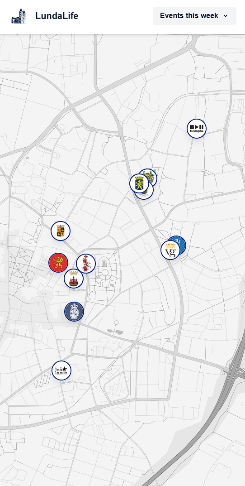

# LundaLife

## About

A next js app that loads events from the STUK API and displays them on a google map. Users can filter events by organization and view event details. Visit [LundaLife](https://lundalife.netlify.app/) to explore events in Lund, Sweden.

## AI Usage

This project was developed with some assistance GitHub Copilot. Copilot was utilized to enhance productivity and code quality. All code generated or suggested by AI has been reviewed, understood and modified by me since I take full responsibility for the final code. This project is primarily for educational purposes which is why I put in the effort to ensure that I comprehend all aspects of the codebase.

## License

This code is published as the final project for CS50 at Harvard University.
For educational and portfolio purposes only. See the [LICENSE](LICENSE) file for usage restrictions.
